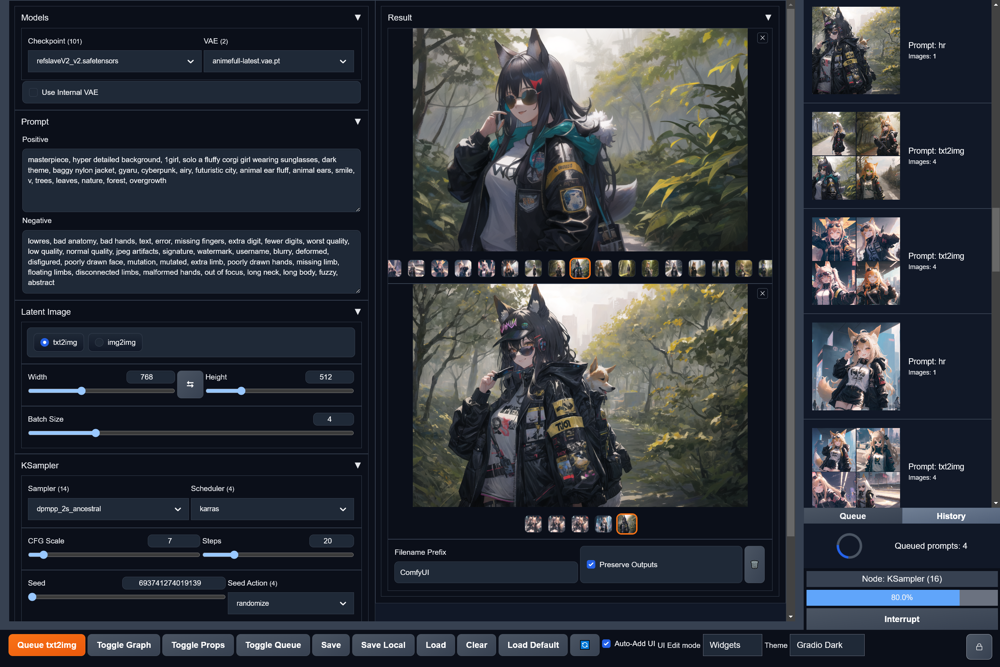

# ComfyBox

An alternative UI to the backend server of the Stable Diffusion webapp [ComfyUI](https://github.com/comfyanonymous/ComfyUI). Build your workflow in a graph structure and have a custom Stable Diffusion interface created for you automatically.

This project is *still under construction* and many features are missing, be aware of the tradeoffs if you're interested in using it.



## NOTE

This frontend isn't compatible with regular ComfyUI's workflow format since extra metadata is saved like panel layout, so you'll have to spend a bit of time recreating them. This project also isn't compatible with regular ComfyUI's frontend extension format, but useful extensions can be integrated into this repo with some effort.

## Proposed Features
- All the power of ComfyUI with more convenience on top
- Autocreation of UI widgets from your workflow, quickly creating a personalized dashboard
- Arrange the UI however you like and attach custom classes/styles to each widget
- Custom widget types
- See the status of queued and finished generations and their configs in realtime
- Development with TypeScript

## Installation

1. Download the latest release [here](https://nightly.link/space-nuko/ComfyBox/workflows/build-and-publish/master/ComfyBox-dist.zip) and extract it somewhere
2. Start the ComfyUI server with `python main.py --enable-cors-header`
3. In the folder you extracted to run `python -m http.server 8000` (or whatever web server you want)
4. Alternately extract the `.zip` into the `dist/` folder of this repository, then open `run.bat`/`run.sh`
5. Visit `http://localhost:8000` in your browser

## Development

### Requirements

- `pnpm`
- An installation of vanilla [ComfyUI](https://github.com/comfyanonymous/ComfyUI) for the backend

### Installation

1. Clone the repo with submodules:

```
git clone https://github.com/space-nuko/ComfyBox --recursive
```

2. `pnpm install`
4. `pnpm build:css`
5. `pnpm dev`
6. Start ComfyUI as usual with `python main.py --enable-cors-header`
7. Visit `http://localhost:3000` in your browser
